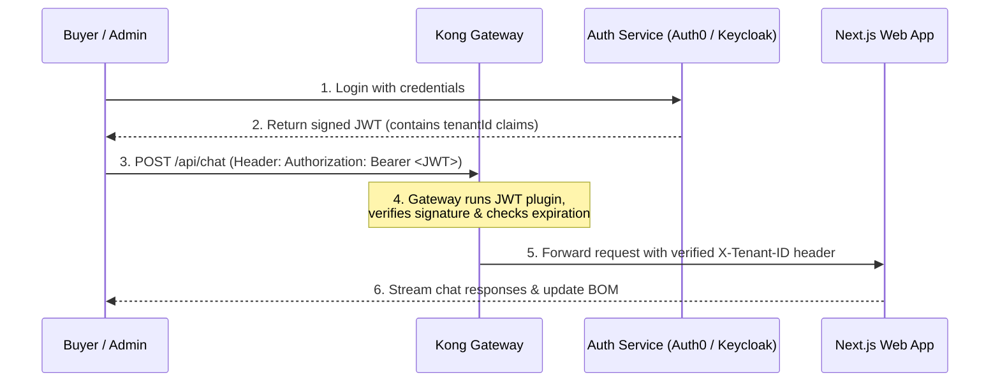

# JourneyAX - Enterprise SaaS Architecture Spec

This document details the system design, monorepo layout, API routing, and orchestration framework for the **JourneyAX Enterprise Agentic Commerce Platform**.

---

## 1. Monorepo Folder Structure (Turborepo)

To manage the frontend apps, administration consoles, and shared B2B modules, we utilize a **Turborepo** workspaces model. This enables fast build caching, shared TypeScript types, and independent deployment cycles.

```text
journeyax-monorepo/
├── apps/
│   ├── journeyax-web/          # Next.js multi-tenant buyer configurator (the core chat UI)
│   └── backoffice-admin/       # React/Next.js administrator console for managing catalog & manual uploads
├── packages/
│   ├── shared-types/           # Shared TS interfaces (Products, BOMs, Quotes, Tenants)
│   ├── configurator-core/      # Tenant-agnostic core rules (WELS rules, warranty parsers, price calculations)
│   └── database/               # Shared Prisma / Mongoose client instance setups
├── config/
│   ├── tenants/                # Tenant-specific YAML / JSON properties
│   │   ├── caroma.yaml
│   │   ├── qzero.yaml
│   │   └── rentacenter.yaml
│   └── gateway/                # Kong API Gateway declarative configurations
├── package.json
├── turbo.json                  # Turborepo task pipeline configuration
└── pnpm-workspace.yaml
```

---

## 2. API Gateway & Routing (Kong API Gateway)

We utilize the open-source **Kong API Gateway** as our single entry point. It is deployed as a dockerized service in front of our Next.js services.

### Declarative Route Mapping (`kong.yml`)
Kong dynamically routes requests to the corresponding application service based on the incoming Host header (subdomains).

```yaml
_format_version: "2.1"
_transform: true

services:
  - name: configurator-service
    url: http://journeyax-web:3000
    routes:
      - name: tenant-configurator-routes
        hosts:
          - "*.journeyax.com"       # Matches brand subdomains (e.g. caroma.journeyax.com)
        paths:
          - /

  - name: backoffice-service
    url: http://backoffice-admin:3000
    routes:
      - name: backoffice-routes
        hosts:
          - "admin.journeyax.com"
        paths:
          - /

plugins:
  - name: cors
    config:
      origins: ["*"]
      methods: ["GET", "POST", "OPTIONS"]
      headers: ["Content-Type", "Authorization", "X-Tenant-ID"]
  - name: rate-limiting
    config:
      minute: 60
      policy: local
```

---

## 3. Native API Authentication & Authorization (JWT Flow)

To secure tenant requests, Kong intercepts incoming calls and validates the JSON Web Token (JWT) before passing the request to the upstream Next.js backend.

### Authentication Flow Diagram


### Kong JWT Plugin Configuration
We enable the JWT plugin on the API Gateway routes to offload token signature verification from our Next.js codebase.

```yaml
plugins:
  - name: jwt
    route: tenant-configurator-routes
    config:
      uri_param_names: ["jwt"]
      cookie_names: []
      key_claim_name: iss
      claims_to_verify: ["exp", "nbf"]
```

The upstream Next.js app reads the secure, gateway-injected `X-Tenant-ID` header to query the database, ensuring perfect logical separation of data without needing isolated server deployments.

---

## 4. MCP (Model Context Protocol) Tool Router

In the **Experience & Agent Layer**, the LLM communicates with the external database and CPQ configurator via the **Model Context Protocol (MCP)**. 

The Tool Router dynamically maps the LLM tool requests based on the active `tenantId` extracted from the gateway request:

```typescript
// services/orchestration/mcp-router.ts
import { search } from '@/services/knowledge/mongo';
import { getTenantConfig } from '@/services/config/tenant';

export async function handleToolCall(
  tenantId: string,
  toolName: string,
  args: any
) {
  // 1. Fetch tenant-specific parameters (e.g. active catalog collection names)
  const tenantConfig = await getTenantConfig(tenantId);
  
  switch (toolName) {
    case 'searchKnowledge':
      return await search(args.embedding, {
        query: args.query,
        brand: tenantConfig.brandName,      // Dynamically restricts RAG to tenant's brand
        category: args.category,
        limit: args.limit || 8
      });
      
    case 'updateQuote':
      // Enforce tenant-specific tax/currency guidelines at tool-level
      return {
        success: true,
        currency: tenantConfig.currency || 'AUD',
        taxRate: tenantConfig.taxRate || 0.10
      };
      
    default:
      throw new Error(`Tool ${toolName} not supported.`);
  }
}
```
