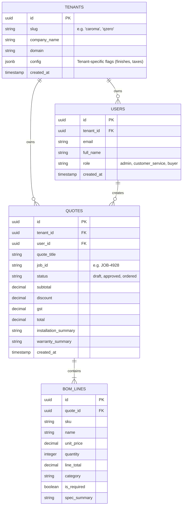

# JourneyAX - Enterprise SaaS Database Schema Spec

This document details the multi-tenant database design for the JourneyAX platform. 

We utilize a **Hybrid Database Architecture**:
1. **PostgreSQL (SQL):** For relational data requiring strict transactional consistency—tenants, user profiles, quotes, Bill of Materials (BOM), and analytics.
2. **MongoDB (NoSQL):** For highly flexible, dynamic, and unstructured product catalogs, brochures, troubleshooting guides, and Vector Search embeddings.

---

## 1. Relational Database Design (PostgreSQL / SQL)

We model tenants, users, and quotes using a shared database with a tenant-foreign-key pattern.



### Prisma Schema Definition (`schema.prisma`)
```prisma
datasource db {
  provider = "postgresql"
  url      = env("DATABASE_URL")
}

model Tenant {
  id          String   @id @default(uuid())
  slug        String   @unique
  companyName String
  domain      String   @unique
  config      Json     // Brand styles, allowed finishes, tax rules
  createdAt   DateTime @default(now())
  
  users       User[]
  quotes      Quote[]
}

model User {
  id        String   @id @default(uuid())
  tenantId  String
  email     String   @unique
  fullName  String
  role      String   // admin, buyer, cs
  createdAt DateTime @default(now())
  
  tenant    Tenant   @relation(fields: [tenantId], references: [id])
  quotes    Quote[]
}

model Quote {
  id                  String    @id @default(uuid())
  tenantId            String
  userId              String
  quoteTitle          String
  jobId               String    @unique
  status              String    @default("draft") // draft, ordered
  subtotal            Decimal
  discount            Decimal
  gst                 Decimal
  total               Decimal
  installationSummary String?
  warrantySummary     String?
  createdAt           DateTime  @default(now())

  tenant    Tenant    @relation(fields: [tenantId], references: [id])
  user      User      @relation(fields: [userId], references: [id])
  bomLines  BomLine[]
}

model BomLine {
  id          String  @id @default(uuid())
  quoteId     String
  sku         String
  name        String
  unitPrice   Decimal
  quantity    Int
  lineTotal   Decimal
  category    String
  isRequired  Boolean @default(false)
  specSummary String?

  quote       Quote   @relation(fields: [quoteId], references: [id], onDelete: Cascade)
}
```

---

## 2. NoSQL Product Catalog & Vector DB (MongoDB)

To enable **zero-deployment tenant onboarding** (adding brands without provisioning new database infra), we use a **Shared Database, Shared Collection** model inside MongoDB.

### Document Schema (`documents` Collection)
Each document represents a chunk of product metadata, manual text, or collection brochure, marked with a `tenantId`.

```json
{
  "_id": { "$oid": "66a8b1f..." },
  "tenantId": "caroma",
  "title": "Liano II Sink Mixer - Lead Free-Chrome",
  "chunk": "Classic, elegant and minimalist style defines the Caroma Liano Collection...",
  "embedding": [0.0023, -0.0152, 0.0841, "...1536 float values..."],
  "sourceUrl": "https://www.caroma.com/au/product/chrome-mixer",
  "metadata": {
    "type": "product",
    "brand": "caroma",
    "sku": "96379C56AF",
    "price": 485.00,
    "collection": "Liano II",
    "finishes": ["Chrome", "Matte Black", "Brushed Nickel"],
    "category": "Tapware",
    "images": [
      "https://cdn.caroma.com/v3/assets/.../Group_1156_(1).png"
    ]
  },
  "createdAt": { "$date": "2026-07-05T12:00:00Z" }
}
```

### MongoDB Atlas Vector Search Index Config (`vector_index`)
To search products for a specific tenant, the Atlas Search Index **must** index `tenantId` as a filter field. This prevents search queries of Brand A from ever seeing Brand B's products.

```json
{
  "fields": [
    {
      "type": "vector",
      "path": "embedding",
      "numDimensions": 1536,
      "similarity": "cosine"
    },
    {
      "type": "filter",
      "path": "tenantId"
    },
    {
      "type": "filter",
      "path": "metadata.brand"
    },
    {
      "type": "filter",
      "path": "metadata.type"
    },
    {
      "type": "filter",
      "path": "metadata.category"
    }
  ]
}
```

### Querying in Code
The search pipeline is isolated at runtime using the `tenantId` header passed from the gateway:

```typescript
// services/knowledge/mongo.ts
export async function searchTenantProducts(
  tenantId: string,
  queryEmbedding: number[],
  options: { category?: string; limit?: number }
) {
  const col = await getCollection();
  const limit = options.limit || 8;

  // Enforce tenant boundary
  const filter: Record<string, any> = {
    tenantId: tenantId
  };

  if (options.category) {
    filter['$or'] = [
      { 'metadata.category': options.category },
      { 'metadata.category': { $exists: false } },
      { 'metadata.category': null }
    ];
  }

  const pipeline = [
    {
      $vectorSearch: {
        index: 'vector_index',
        path: 'embedding',
        queryVector: queryEmbedding,
        numCandidates: limit * 10,
        limit: limit,
        filter: filter // Strictly isolated by tenantId
      }
    }
  ];

  return await col.aggregate(pipeline).toArray();
}
```
