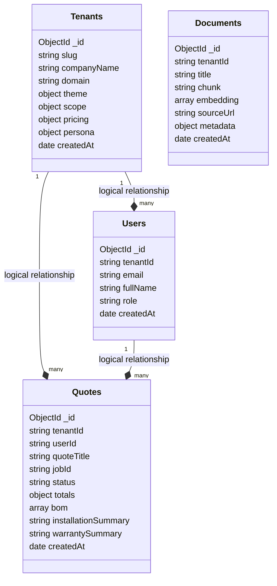

# JourneyAX - Enterprise SaaS Database Schema Spec (Pure MongoDB)

This document details the multi-tenant database design for the JourneyAX platform. 

Instead of running a hybrid stack, we consolidate **100% of our data stores into MongoDB**. This simplifies our infrastructure, reduces deployment overhead, and allows us to take advantage of MongoDB's document-model performance benefits (e.g. embedding the Bill of Materials directly inside Quote documents).

---

## 1. Core Architectural Benefits of Pure MongoDB

1. **One Database, One Connection:** Simplifies DevOps. The Next.js app only manages a single MongoDB pool (`MONGODB_URI`).
2. **Embedded Documents for BOMs:** In SQL, the Bill of Materials (BOM) must be split into a separate table (`BOM_LINES`) and joined via foreign keys. In MongoDB, we store the BOM as an **embedded array of objects** directly inside the `quotes` document. This allows us to retrieve a complete quote with its items in a **single database read operation** with zero joins.
3. **No Schema Migration Overhead:** Adding tenant-specific configurations or new product parameters doesn't require database schema migrations. We just store them dynamically in the JSON document.
4. **Transactions Support:** MongoDB fully supports ACID transactions (sessions) if transactional consistency across multiple collections is needed.

---

## 2. Document Collection Designs

We model our data using four primary collections inside the shared database.



### Collection 1: `tenants`
Stores tenant profile configurations.
```json
{
  "_id": { "$oid": "66a8b1f1001..." },
  "slug": "caroma",
  "companyName": "Caroma Industries",
  "domain": "caroma.journeyax.com",
  "theme": {
    "primaryColor": "#0F172A",
    "accentColor": "#D97706",
    "fontFamily": "Outfit, sans-serif"
  },
  "scope": {
    "rooms": ["bathroom", "kitchen", "laundry"],
    "finishes": ["chrome", "matte_black", "brushed_nickel"]
  },
  "pricing": {
    "currency": "AUD",
    "taxRate": 0.10,
    "discountRate": 0.12
  },
  "llmConfiguration": {
    "providers": [
      {
        "id": "openai_prod",
        "name": "Production OpenAI",
        "provider": "openai",
        "apiKeyRef": "vault/openai/caroma",
        "model": "gpt-4o-mini",
        "temperature": 0.2
      }
    ],
    "routingRules": [
      { "target": "chat", "providerId": "openai_prod", "model": "gpt-4o-mini" },
      { "target": "bom_generation", "providerId": "openai_prod", "model": "gpt-4o" }
    ]
  },
  "agenticCommerceSettings": {
    "enabled": true,
    "provider": "commercetools",
    "commercetoolsSettings": {
      "projectKey": "caroma-poc-ctp",
      "clientId": "client_id_ref",
      "clientSecretRef": "vault/ctp/caroma/secret",
      "apiUrl": "https://api.australia-southeast1.gcp.commercetools.com"
    }
  },
  "createdAt": { "$date": "2026-07-05T12:00:00Z" }
}
```

### Collection 2: `users`
Stores buyer and admin accounts.
```json
{
  "_id": { "$oid": "66a8b1f2002..." },
  "tenantId": "caroma",
  "email": "buyer@caromabuilds.com.au",
  "fullName": "Mahaveer",
  "role": "buyer",
  "createdAt": { "$date": "2026-07-05T12:05:00Z" }
}
```

### Collection 3: `quotes`
Stores quotes and BOMs. Notice that the BOM lines are embedded directly inside the document.
```json
{
  "_id": { "$oid": "66a8b1f3003..." },
  "tenantId": "caroma",
  "userId": "66a8b1f2002...",
  "quoteTitle": "Your Liano Bathroom Quote",
  "jobId": "JOB-2938",
  "status": "draft",
  "totals": {
    "subtotal": 1475.00,
    "discount": 177.00,
    "gst": 129.80,
    "total": 1427.80
  },
  "bom": [
    {
      "sku": "96379C56AF",
      "name": "Liano II Sink Mixer - Lead Free-Chrome",
      "price": 485.00,
      "quantity": 1,
      "category": "Tapware",
      "isRequired": true,
      "reason": "Classic Liano minimalist styling in chrome finish."
    },
    {
      "sku": "99671C56AF",
      "name": "Caroma Urbane II Toilet Suite",
      "price": 990.00,
      "quantity": 1,
      "category": "Toilet Suites",
      "isRequired": true,
      "reason": "Matching modern Urbane styling."
    }
  ],
  "installationSummary": "Standard mixer installation rough-in instructions. Inwall body must be mounted prior to tiling.",
  "warrantySummary": "20 year warranty on tapware, 10 year on toilet cisterns.",
  "createdAt": { "$date": "2026-07-05T12:10:00Z" }
}
```

### Collection 4: `documents` (Product Catalog + Vectors)
Stores the catalog chunks and embeddings (Option 1: Shared Database, Shared Collection).
```json
{
  "_id": { "$oid": "66a8b1f4004..." },
  "tenantId": "caroma",
  "title": "Liano II Sink Mixer - Lead Free-Chrome",
  "chunk": "Classic, elegant and minimalist style defines the Caroma Liano Collection...",
  "embedding": [0.0023, -0.0152, 0.0841, "...1536 float values..."],
  "sourceUrl": "https://www.caroma.com/au/product/chrome-mixer",
  "metadata": {
    "type": "product",
    "brand": "caroma",
    "sku": "96379C56AF",
    "price": 485.00,
    "collection": "Liano II",
    "finishes": ["Chrome", "Matte Black", "Brushed Brass"],
    "category": "Tapware",
    "images": [
      "https://cdn.caroma.com/v3/assets/.../Group_1156_(1).png"
    ]
  },
  "createdAt": { "$date": "2026-07-05T12:00:00Z" }
}
```

---

## 3. Index Configurations

To ensure isolated, high-speed queries, we create the following indexes in MongoDB:

1. **`tenants` Collection:**
   - Unique Index on `slug` (for domain-mapping lookups).
2. **`users` Collection:**
   - Unique Index on `email` (for login lookups).
   - Filter Index on `tenantId` (for listing tenant users).
3. **`quotes` Collection:**
   - Unique Index on `jobId`.
   - Compound Index on `{ tenantId: 1, userId: 1 }` (for listing quotes for a specific user within a tenant brand).
4. **`documents` Collection (Atlas Vector Search Index):**
   - The vector search index configuration, including tenantId filtering:
```json
{
  "fields": [
    {
      "type": "vector",
      "path": "embedding",
      "numDimensions": 1536,
      "similarity": "cosine"
    },
    {
      "type": "filter",
      "path": "tenantId"
    },
    {
      "type": "filter",
      "path": "metadata.brand"
    },
    {
      "type": "filter",
      "path": "metadata.type"
    },
    {
      "type": "filter",
      "path": "metadata.category"
    }
  ]
}
```


---

## 2. NoSQL Product Catalog & Vector DB (MongoDB)

To enable **zero-deployment tenant onboarding** (adding brands without provisioning new database infra), we use a **Shared Database, Shared Collection** model inside MongoDB.

### Document Schema (`documents` Collection)
Each document represents a chunk of product metadata, manual text, or collection brochure, marked with a `tenantId`.

```json
{
  "_id": { "$oid": "66a8b1f..." },
  "tenantId": "caroma",
  "title": "Liano II Sink Mixer - Lead Free-Chrome",
  "chunk": "Classic, elegant and minimalist style defines the Caroma Liano Collection...",
  "embedding": [0.0023, -0.0152, 0.0841, "...1536 float values..."],
  "sourceUrl": "https://www.caroma.com/au/product/chrome-mixer",
  "metadata": {
    "type": "product",
    "brand": "caroma",
    "sku": "96379C56AF",
    "price": 485.00,
    "collection": "Liano II",
    "finishes": ["Chrome", "Matte Black", "Brushed Nickel"],
    "category": "Tapware",
    "images": [
      "https://cdn.caroma.com/v3/assets/.../Group_1156_(1).png"
    ]
  },
  "createdAt": { "$date": "2026-07-05T12:00:00Z" }
}
```

### MongoDB Atlas Vector Search Index Config (`vector_index`)
To search products for a specific tenant, the Atlas Search Index **must** index `tenantId` as a filter field. This prevents search queries of Brand A from ever seeing Brand B's products.

```json
{
  "fields": [
    {
      "type": "vector",
      "path": "embedding",
      "numDimensions": 1536,
      "similarity": "cosine"
    },
    {
      "type": "filter",
      "path": "tenantId"
    },
    {
      "type": "filter",
      "path": "metadata.brand"
    },
    {
      "type": "filter",
      "path": "metadata.type"
    },
    {
      "type": "filter",
      "path": "metadata.category"
    }
  ]
}
```

### Querying in Code
The search pipeline is isolated at runtime using the `tenantId` header passed from the gateway:

```typescript
// services/knowledge/mongo.ts
export async function searchTenantProducts(
  tenantId: string,
  queryEmbedding: number[],
  options: { category?: string; limit?: number }
) {
  const col = await getCollection();
  const limit = options.limit || 8;

  // Enforce tenant boundary
  const filter: Record<string, any> = {
    tenantId: tenantId
  };

  if (options.category) {
    filter['$or'] = [
      { 'metadata.category': options.category },
      { 'metadata.category': { $exists: false } },
      { 'metadata.category': null }
    ];
  }

  const pipeline = [
    {
      $vectorSearch: {
        index: 'vector_index',
        path: 'embedding',
        queryVector: queryEmbedding,
        numCandidates: limit * 10,
        limit: limit,
        filter: filter // Strictly isolated by tenantId
      }
    }
  ];

  return await col.aggregate(pipeline).toArray();
}
```

---

## 4. Mandatory Repository-Level Tenant Isolation

To enforce perfect security boundary conditions (SOC2 compliance) and prevent cross-tenant data leaks due to developer coding errors, we introduce the **BaseRepository** pattern into `@journeyax/database`.

Every single repository class (e.g. `QuoteRepository`, `UserRepository`) extends a base class that programmatically intercept calls, validates the presence of `tenantId`, and wraps queries in the active tenant's context.

### Conceptual BaseRepository Implementation
```typescript
// packages/database/src/base.repository.ts
import { Collection, Document, Filter, OptionalUnlessRequiredId } from 'mongodb';
import { getDb } from './index';

export abstract class BaseRepository<T extends Document> {
  constructor(protected readonly collectionName: string) {}

  protected async getCollection(): Promise<Collection<T>> {
    const db = getDb();
    return db.collection<T>(this.collectionName);
  }

  /**
   * Enforce tenantId validation at database entry point
   */
  private validateTenant(tenantId: string) {
    if (!tenantId) {
      throw new Error(`TENANT_ENFORCEMENT_ERROR: tenantId must be provided for database operations in '${this.collectionName}'`);
    }
  }

  async create(tenantId: string, doc: OptionalUnlessRequiredId<T>): Promise<T> {
    this.validateTenant(tenantId);
    const col = await this.getCollection();
    
    // Auto-inject tenantId to document to prevent developer bypasses
    const documentToSave = { ...doc, tenantId } as OptionalUnlessRequiredId<T>;
    const result = await col.insertOne(documentToSave);
    
    return { ...documentToSave, _id: result.insertedId } as unknown as T;
  }

  async find(tenantId: string, filter: Filter<T> = {}): Promise<T[]> {
    this.validateTenant(tenantId);
    const col = await this.getCollection();
    
    // Dynamic query injection of tenantId filter
    const tenantFilter = { ...filter, tenantId } as Filter<T>;
    return col.find(tenantFilter).toArray();
  }

  async findOne(tenantId: string, filter: Filter<T>): Promise<T | null> {
    this.validateTenant(tenantId);
    const col = await this.getCollection();
    
    const tenantFilter = { ...filter, tenantId } as Filter<T>;
    return col.findOne(tenantFilter);
  }

  async updateOne(tenantId: string, filter: Filter<T>, update: Partial<T>): Promise<boolean> {
    this.validateTenant(tenantId);
    const col = await this.getCollection();
    
    const tenantFilter = { ...filter, tenantId } as Filter<T>;
    const result = await col.updateOne(tenantFilter, { $set: update });
    return result.modifiedCount > 0;
  }

  async deleteMany(tenantId: string, filter: Filter<T>): Promise<number> {
    this.validateTenant(tenantId);
    const col = await this.getCollection();
    
    const tenantFilter = { ...filter, tenantId } as Filter<T>;
    const result = await col.deleteMany(tenantFilter);
    return result.deletedCount;
  }
}
```

By making it impossible to query a repository without specifying `tenantId` in the first argument, we establish a **strict cryptographic/logical boundary** for all B2B clients using the unified database.

